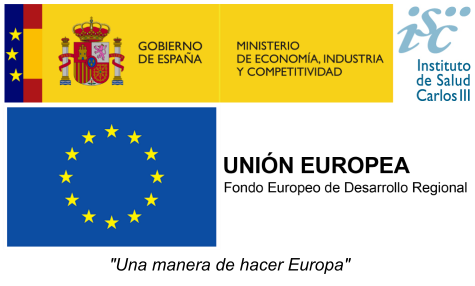

# Curso de Introducción a la Inferencia Causal en Epidemiología
### XX-YY Octubre, Escuela Andaluza de Salud Pública, Granada

---------------------

# Descripción del curso

El Curso de Introducción a la Inferencia Causal en Epidemiología está dirigido a **estadísticos** y **epidemiólogos** de la administración sanitaria interesados en la Inferencia Causal, con conocimientos en **Estadística Aplicada a las Ciencias de la Salud y Epidemiología**.

## Objetivos

El objetivo general del curso es ofrecer una visión general de los nuevos métodos en epidemiología basados en el marco conceptual de las "*Potential Outcomes*" y las técnicas estadísticas utilizadas para evaluar la efectividad de intervenciones o tratamientos basada en datos observacionales.

Los objetivos específicos son:

1. Obtener una visión general del desarrollo de la disciplina y la necesidad de la Inferencia Causal. 
2. Entender y aplicar el marco conceptual de las "*Potential Outcomes*" en escenarios simples.  
3. Entender y construir modelos causales visuales usando gráficos acíclicos directos (DAGs).  
4. Entender y aplicar los diferentes métodos estadísticos para evaluar el efecto causal marginal y estandarizado del tratamiento o exposición basado en la aplicación de la "*G-Formula*".

## Contenidos

1. Introducción al marco conceptual de las "*Potential Outcomes*"  
2. Introducción a la visualización de asociaciones y efectos causales usando DAGs (gráficos acíclicos directos)
3. Introducción a los G-métodos y generalización de la estandarización.
4. Derivación y uso de los G-métodos basados en el "*propensity score*" y la G-computación en **Stata** (módulo *teffect*) y **R** (paquetes *IPW* y *TMLE*).

## Metodología

- Lectura magistral seguida de ejercicios prácticos en ordenador usando los paquetes estadísticos **R** (*IPW* y *TMLE*), **Stata** (*teffects*) y **DAGitty**.
- Las clases se impartirán en español, pero el material docente y los ejercicios serán impartidos en inglés.
- El curso incluye una sesión previa de conceptos matemáticos estadísticos necesarios para la presentación del contenido del mismo.

## Competencias profesionales

El alumno a la finalización del curso será capaz de:

1. Interpretar y evaluar la literatura epidemiológica avanzada.
2. Aplicar e interpretar la "*G-Formula*".
3. Aplicar e interpretar métodos de inferencia causal en estudios observacionales transversales.

## Sistema de evaluación

Participación en clase y prácticas.

---------------------

# Inscripción

## El enlace de inscripción estará disponible próximamente.

El curso se llevará a cabo en la Escuela Andaluza de Salud Pública (EASP).

## Cómo llegar:

<iframe src="https://www.google.com/maps/embed?pb=!1m18!1m12!1m3!1d3178.4212631460427!2d-3.5963263488661434!3d37.190222453247834!2m3!1f0!2f0!3f0!3m2!1i1024!2i768!4f13.1!3m3!1m2!1s0xd71fcdb20c77b63%3A0x8de42283942f9bcc!2sEscuela+Andaluza+de+Salud+P%C3%BAblica!5e0!3m2!1ses!2ses!4v1529391584616" width="600" height="450" frameborder="0" style="border:0" allowfullscreen></iframe>  

### [Cómo llegar a la EASP](http://www.easp.es/la-escuela/contacte-con-nosotros/como-llegar/) / [How to get to EASP (English)](https://www.easp.es/wp-content/uploads/2017/11/How-to-get-to-EASP.pdf)

---------------------

# Material del curso

Aquí irá el material del curso, con algunos enlaces...

## Lecturas preliminares

1. Lectura 1 
2. Lectura 2  
3. Lectura 3 <button onclick="window.open('https://github.com/migariane/CrashCourseCausalInference/tree/master/content/Lecturas/Lecture3.pdf')">Download</button>
            
---------------------

# Profesores

We are a team with a broad multidisciplinary background, leading cancer research in Spain and Europe.

We develop our work in the [**Granada Cancer Registry**](http://www.cancergranada.org), at the [**Andalusian School of Public Health**](http://www.easp.es/).

### **Miguel Ángel Luque Fernández, MA, MPH, MSc, PhD**
Senior Scientific Researcher of Epidemiology and Biostatistics  
Miguel Servet I Award, Carlos III Institute of Health Grant/Award Number: CP17/002026  
Ibs.Granada, Andalusian School of Public Health.  
Cuesta del Observatorio, 4, 18080  
Granada, Spain    
[Hugo Academic Webpage](http://watzilei.com/maluque.html)  

Visitor Scientist, Department of Epidemiology,    
TH Chan Harvard School of Public Health, Boston, MA, U.S.A.     
[HSPH Webpage](https://scholar.harvard.edu/malf)      
 
Assistant Professor of Epidemiology and Biostatistics (Honorary)   
Department of Non-Communicable Disease Epidemiology  
London School of Hygiene and Tropical Medicine, London, U.K.    
[LSHTM Academic Webpage](http://www.lshtm.ac.uk/aboutus/people/luque.miguel-angel)  

Tutorials [Link to Epidemiological and Statistical tutorials](http://migariane.github.io/)

###  [@watzilei](http://www.twitter.com/watzilei)

###   [@migariane](https://github.com/migariane)

###   *miguel.luque.easp at juntadeandalucia.es*

---------------------

### **Daniel Redondo Sánchez, Mathematician**

Research Assistant of Epidemiology and Biostatistics.

Biomedical Research Institute of Granada, Andalusian School of Public Health.  
Cuesta del Observatorio, 4, 18080  
Granada, Spain

###  [@dredondosanchez](http://www.twitter.com/dredondosanchez)

###  [@danielredondo](https://github.com/danielredondo)

###   *daniel.redondo.easp at juntadeandalucia.es*

---------------------

